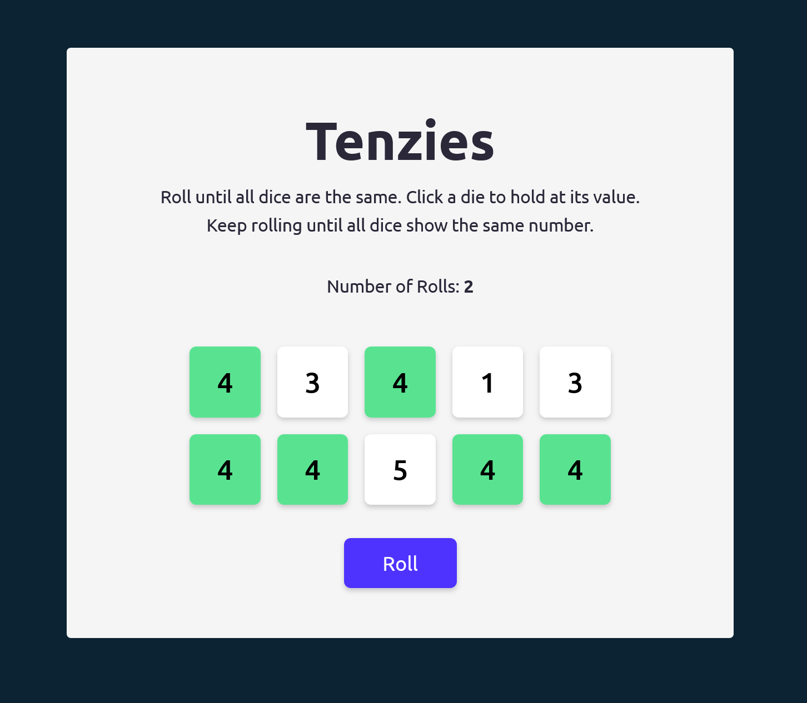

# Tenzies Dice Game - React App

A basic tenzies dice game app, built as part of the [Scrimba Frontend Career Path](https://scrimba.com/).

## Table of contents

- [Overview](#overview)
  - [React concepts](#react-concepts)
  - [Requirements](#requirements)
  - [Enhancements](#enhancements)
  - [Screenshot](#screenshot)
  - [Links](#links)
- [My process](#my-process)
  - [Built with](#built-with)
  - [What I learned](#what-i-learned)
  - [Continued development](#continued-development)
  - [Useful resources](#useful-resources)
- [Author](#author)

## Overview

### React concepts
This project features the use of the following React hooks and concepts

- useState and useEffect
- Conditional rendering
- Side effects

### Requirements
- Display ten randomly generated dice values (1 to 6) to the user
- Click an individual die to hold the die at the current value
- Click the roll button to roll all dice not being held
- Display a win condition when user has held all 10 dice at the same value

### Enhancements
Project enhancements beyond course tutorial content:

Completed:
- Improved seperation of components 
- Added constants and game-helpers files for better organization and future game expansion
- Number of rolls tracked
- Improve and streamline implementation of styling (modern CSS)

Future:
- Improve win condition messaging and confetti implementation
- Create realistic-looking dice with CSS
- Track time it took to win
- Save best time/low rolls to localStorage

### Screenshot



### Links

- [Live Site URL]()

## My process

### Built with

- Semantic HTML5 markup
- CSS custom properties
- Flexbox
- CSS Grid
- Mobile-first workflow
- [React](https://reactjs.org/) - JS library
- [Vite](https://vitejs.dev/) - Frontend tooling

### What I learned

This simple function forms the foundation of the app, utilizing modern JS (map method, arrow functions, and ternary operator), accessing React State, and allowing for the primary button to be used to both roll and restart a game.
```js
  function rollDice() {
    if (!tenzies) {
      setDice(prevDice => prevDice.map(die => {
        return die.isHeld ?
          die :
          generateNewDie()
      }))
      setRollCount((prevRollCount) => prevRollCount + 1)
    } else {
      restartGame();
    }
  }
```

### Continued development

The concepts practiced here will lead straight into my next React project, Quizzical. There I'll build upon what I've learned in this project and lean heavily on Scrimba course work as well as curriculum material from Josh Comeau's [Joy of React](https://www.joyofreact.com/) course.

### Useful resources

- [React Docs](https://react.dev/learn) - Outside of the Scrimba curriculum materials leading up to this project, I found the official React documentation an excellent reference.
- [Vite Docs](https://vitejs.dev/guide/) - Simple and easy to understand guides to getting started using Vite.

## Author

- Website - [Matt Pahuta](https://www.mattpahuta.com)
- Twitter/X - [@mattpahuta](https://www.twitter.com/MattPahuta)
- LinkedIn - [Matt Pahuta](www.linkedin.com/in/mattpahuta)
